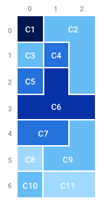

A rectangular map consisting of N rows and M columns of square areas is given. Each area is painted with a certain color.

Two areas on the map belong to the same country if the following conditions are met:

they have the same color;
it is possible to travel from one area to the other orthogonally (that is, by moving only north, south, west or east) without moving over areas of a different color.
The map can be described by a zero-indexed matrix A consisting of N rows and M columns of integers. The color of each area is described by the corresponding element of the matrix. Two areas have the same color if and only if their corresponding matrix elements have the same value.

For example, consider the following matrix A consisting of seven rows and three columns:

A[0][0] = 5    A[0][1] = 4    A[0][2] = 4
A[1][0] = 4    A[1][1] = 3    A[1][2] = 4
A[2][0] = 3    A[2][1] = 2    A[2][2] = 4
A[3][0] = 2    A[3][1] = 2    A[3][2] = 2
A[4][0] = 3    A[4][1] = 3    A[4][2] = 4
A[5][0] = 1    A[5][1] = 4    A[5][2] = 4
A[6][0] = 4    A[6][1] = 1    A[6][2] = 1
Matrix A describes a map that is colored with five colors. The areas on the map belong to eleven different countries (C1−C11), as shown in the following figure:

Write a function

class Solution { public int solution(int[][] A); }

that, given a zero-indexed matrix A consisting of N rows and M columns of integers, returns the number of different countries to which the areas of the map described by matrix A belong.

For example, given matrix A consisting of seven rows and three columns corresponding to the example above, the function should return 11.

Write an efficient algorithm for the following assumptions:

N and M are integers within the range [1..300,000];
the number of elements in matrix A is within the range [1..300,000];
each element of matrix A is an integer within the range [−1,000,000,000..1,000,000,000].