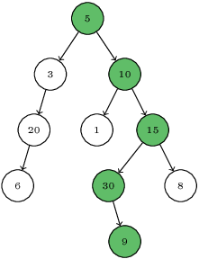

In this problem we consider binary trees. Let's define a turn on a path as a change in the direction of the path (i.e. a switch from right to left or vice versa). A zigzag is simply a sequence of turns (it can start with either right or left). The length of a zigzag is equal to the number of turns.

Consider binary tree below:

There are two turns on the marked path. The first one is at [15]; the second is at [30]. That means that the length of this zigzag is equal to 2. This is also the longest zigzag in the tree under consideration. In this problem you should find the longest zigzag that starts at the root of any given binary tree and form a downwards path.

Note that a zigzag containing only one edge or one node has length 0.

Problem
Write a function:

class Solution { public int solution(Tree T); }

that, given a non-empty binary tree T consisting of N nodes, returns the length of the longest zigzag starting at the root.

For example, given tree T shown in the figure above, the function should return 2, as explained above. Note that the values contained in the nodes are not relevant in this task.

Technical details
A binary tree can be specified using a pointer data structure. Assume that the following declarations are given:

class Tree {
  public int x;
  public Tree l;
  public Tree r;
}

An empty tree is represented by an empty pointer (denoted by null). A non-empty tree is represented by a pointer to an object representing its root. The attribute x holds the integer contained in the root, whereas attributes l and r hold the left and right subtrees of the binary tree, respectively.

For the purpose of entering your own test cases, you can denote a tree recursively in the following way. An empty binary tree is denoted by None. A non-empty tree is denoted as (X, L, R), where X is the value contained in the root and L and R denote the left and right subtrees, respectively. The tree from the above figure can be denoted as:

  (5, (3, (20, (6, None, None), None), None), (10, (1, None, None), (15, (30, None, (9, None, None)), (8, None, None))))
Assumptions
Write an efficient algorithm for the following assumptions:

N is an integer within the range [1..100,000];
the height of tree T (number of edges on the longest path from root to leaf) is within the range [0..800].